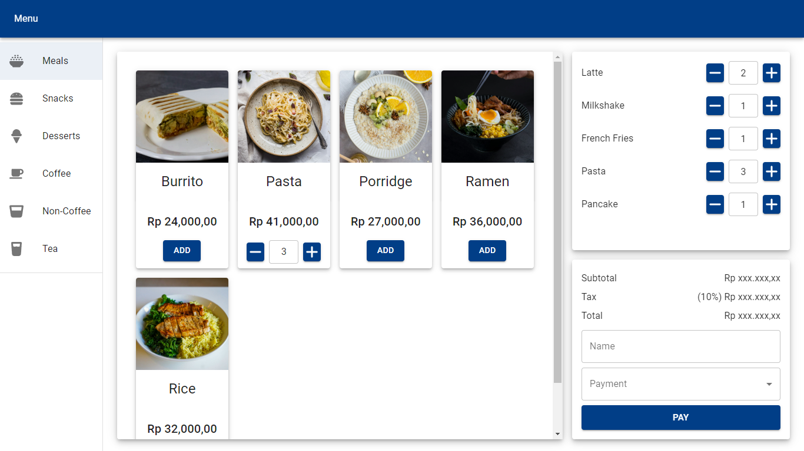

# Cafe POS app
- Link to deployed frontend: https://cafepos.farishasan.web.id
- Link to deployed backend: https://cafepos.farishasan.web.id/api/v1/docs (documentation)
- My other projects: https://farishasan.web.id
## Information
- Start Date: October 2024
- Description:  This is a simple POS app for a cafe. It allows users to add items to their order, view their order, and checkout with payment gateway (Midtrans). The app also includes a menu with prices for the items.
## Tech Stack used
### Frontend
- Midtrans
- Vite + React (Javascript)
- Material UI
### Backend
- Midtrans
- Node + Express(Javascript)
- MySQL
- Sequelize
### Deployment
- Ubuntu 20.04
- Nginx
- GitHub Actions (CI/CD)
## Screenshots
